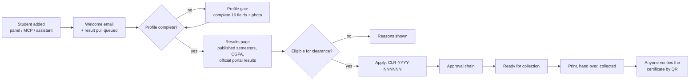
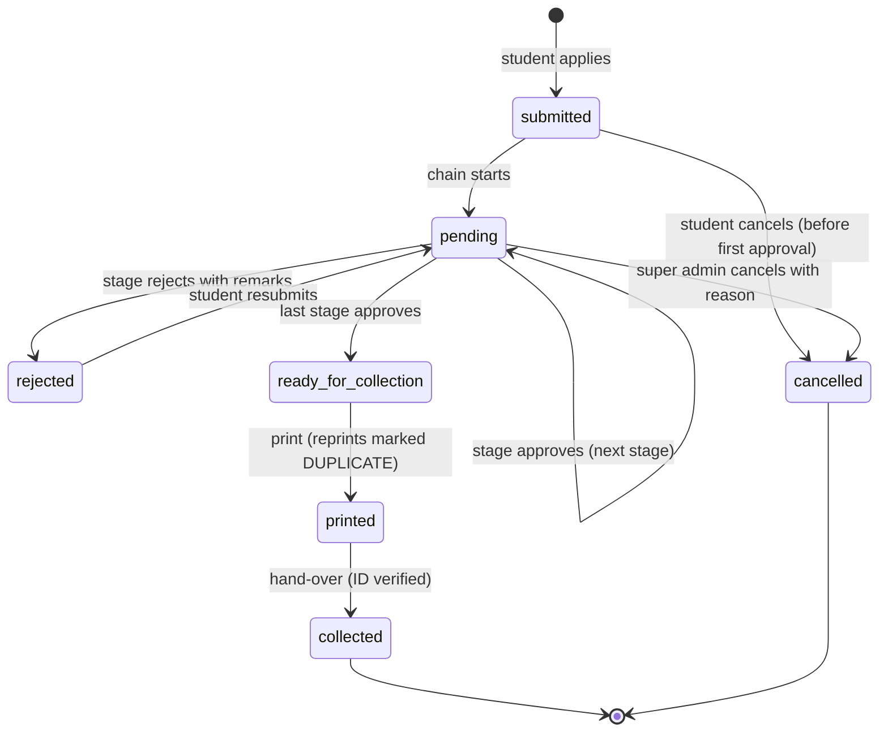
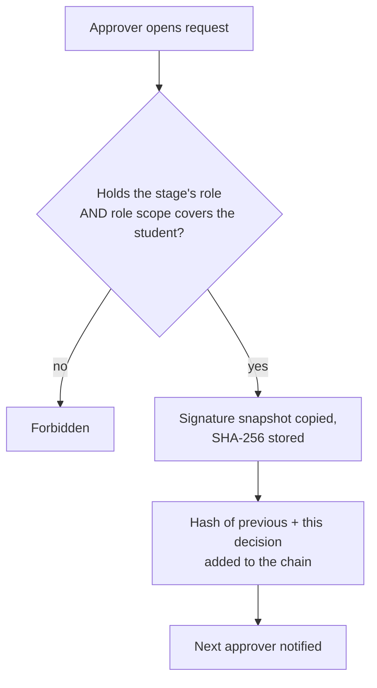
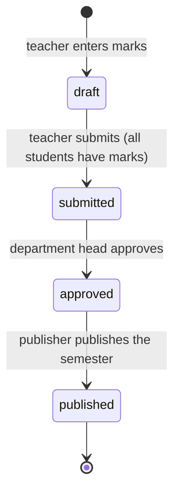
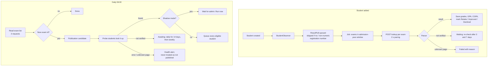
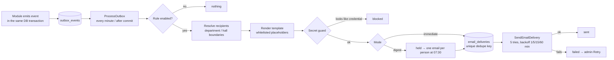
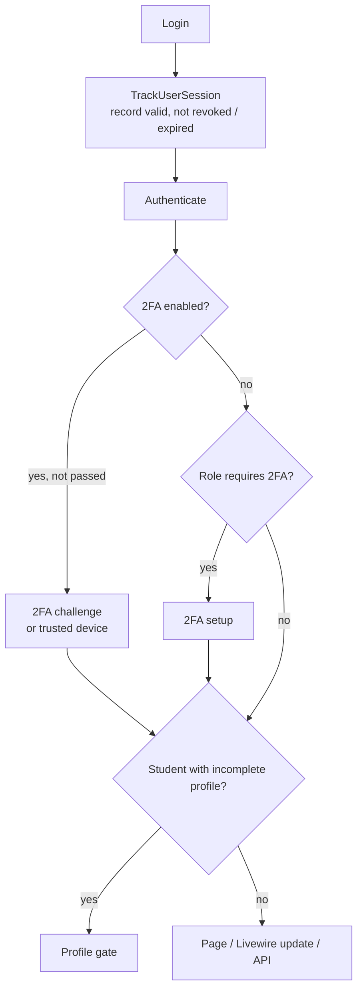
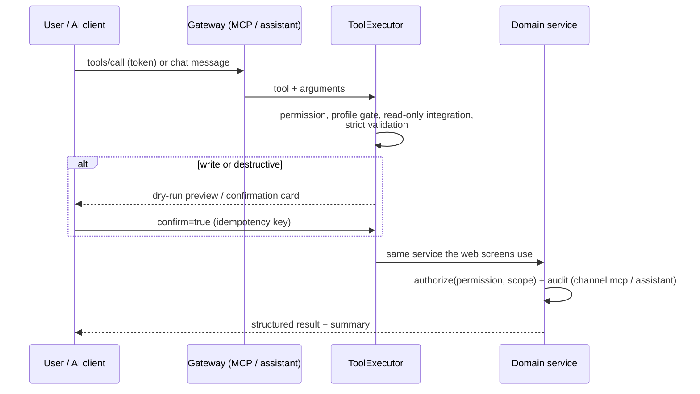
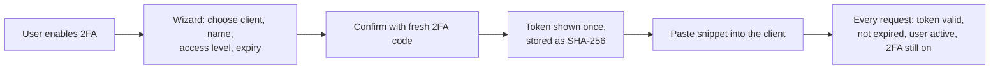

# Workflows and diagrams

How the main processes work, as diagrams (Mermaid; they render on GitHub and in most Markdown viewers). Each diagram is checked against the code; the decision records are in `DECISIONS.md`.

## 1. Student journey

## 2. Clearance request states

Default chain: **hall → library → department → head of institution**. Non-residents skip the hall stage; stages can be turned off, re-ordered or made skippable (Settings → Clearance stages). One class, `ClearanceService::transition()`, is the only writer of the status and uses an optimistic version lock.

## 3. Results workflow

Students (and the student-facing read channels) only ever see `published` results. CGPA uses the best attempt of a repeated course, counts a failed course as 0.00, and rounds half-up to 2 decimals.

## 4. Official results from the university portal

## 5. Email notification pipeline

## 6. Sign-in and security checks (every request)

The same chain runs on every Livewire update, so a page left open after logout, revocation or deactivation stops working (HTTP 419 → reload to login).

## 7. How an AI client or the assistant acts

## 8. Creating an AI integration

